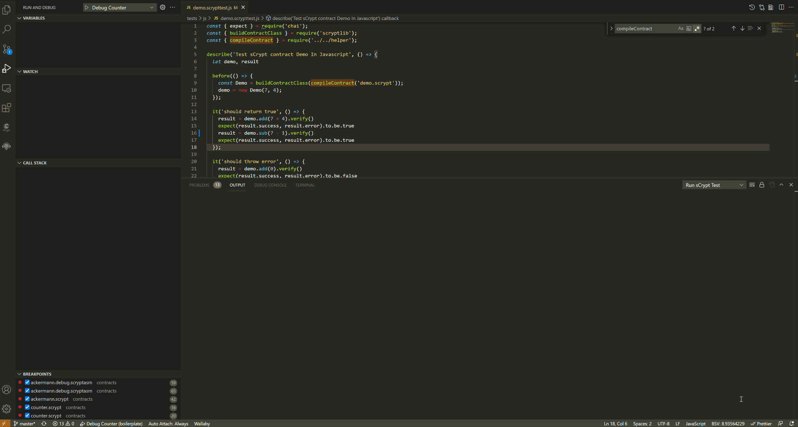

---
layout:
  title:
    visible: true
  description:
    visible: false
  tableOfContents:
    visible: true
  outline:
    visible: true
  pagination:
    visible: true
---

# Scrypt Boilerplate

**Note:** Modified to use @radiantblockchian/radjs for testnet/superAssetR100.js

## sCrypt Project Boilerplate <a href="#scrypt-project-boilerplate" id="scrypt-project-boilerplate"></a>

[](https://travis-ci.com/sCrypt-Inc/boilerplate)

[https://github.com/RadiantBlockchain-Community/scrypt-boilerplate](https://github.com/RadiantBlockchain-Community/scrypt-boilerplate)

### Prerequisites <a href="#prerequisites" id="prerequisites"></a>

Make sure you have the [sCrypt IDE](https://scrypt-ide.readthedocs.io/en/latest/index.html) installed. **sCrypt IDE** is a tool for developers to write, test, deploy, call, and debug sCrypt smart contracts.

### Guide <a href="#guide" id="guide"></a>

[**sCrypt**](https://scryptdoc.readthedocs.io/) is a high-level programming language for writing smart contracts on Bitcoin SV. This project provides examples to help developers learn and integrate sCrypt smart contracts to their Javascript-based projects. Our recommended procedure of developing smart contract based applications is as follows:

1. Contract Development and Test
2. Contract Integration and Application Launch

After developing and unit testing the smart contracts, the next step is to integrate them into your application which is written in other languages such as Javascript or Python. Integration tests should be run on Bitcoin SV [Testnet](https://test.whatsonchain.com/) or [Scaling Test Network(STN)](https://bitcoinscaling.io/) before launching the application to the public on mainnet.

### Quickstart <a href="#quickstart" id="quickstart"></a>

```
npm install
npm test
```

### Directory layout <a href="#directory-layout" id="directory-layout"></a>

For each contract `x`, a source file is at `contracts/x.scrypt`, a test file is at `tests/js/x.scrypttest.js`, and a deployment file is at `testnet/x.js`.

```
.
├── contracts                       # sCrypt contract files
│   ├── accumulatorMultiSig.scrypt      # 
│   ├── ackermann.scrypt                # 
│   ├── acs.scrypt                      # A contract which can be spent by anyone but only to a specific address
│   ├── advancedCounter.scrypt          # Use external UTXOs to pay  contract tx fees using sighash ANYONECANPAY
│   ├── advancedTokenSale.scrypt        # Sambe as above, but for token sale contract
│   ├── asm.scrypt                      # Embed Script directly into sCrypt 
│   ├── auction.scrypt                  # 
│   ├── binaryOption.scrypt             # 
│   ├── cltv.scrypt                     # 
│   ├── cointoss.scrypt                 # 
│   ├── cointossxor.scrypt              # 
│   ├── conwaygol.scrypt                # 
│   ├── counter.scrypt                  # Count the number of times a function has been called to showcase 
│   ├── ec.scrypt                       # 
│   ├── ecdsa.scrypt                    # 
│   ├── demo.scrypt                     # "hello world" contract
│   ├── faucet.scrypt                   # 
│   ├── forward.scrypt                  # 
│   ├── hashpuzzlep2pkh.scrypt          # combining  and p2pkh contracts
│   ├── kaggle.scrypt                   # 
│   ├── lottery.scrypt                  # 
│   ├── mast.scrypt                     # 
│   ├── merkleToken.scrypt              # Token based on Merkle Tree
│   ├── merkleTree.scrypt               #  validation and updating
│   ├── nonFungibleToken.scrypt         # 
│   ├── oracle.scrypt                    # 
│   ├── p2pkh.scrypt                    #  contract written in sCrypt
│   ├── p2sh.scrypt                     # 
│   ├── perceptron.scrypt               # 
│   ├── perceptron2.scrypt              # 
│   ├── rabin.scrypt                    #  to import off-chain data into a contract via oracle
│   ├── recurring.scrypt                # 
│   ├── rpuzzle.scrypt                  # 
│   ├── schnorr.scrypt                  # 
│   ├── rps.scrypt                      # Rock Paper Scissors
│   ├── simpleBVM.scrypt                # 
│   ├── spvToken.scrypt                 # 
│   ├── statecounter.scrypt             # 
│   ├── stateStruct.scrypt              # Recommended way to implement a stateful contract using struct
│   ├── sudoku.scrypt                   # 
│   ├── svd.scrypt                      # 
│   ├── tictactoe.scrypt                #  onchain p2p gaming
│   ├── timedcommit.scrypt              # : Trustless contracting by combining on-chain and off-chain transactions
│   ├── token.scrypt                    #  by storing token map as contract state in a single UTXO
│   ├── tokenSale.scrypt                # Selling tokens for bitcoins using 
│   ├── tokenSwap.scrypt                # Merkle tree-based token and bitcoin swap 
│   ├── tokenUtxo.scrypt                # 
│   ├── treeSig.scrypt                  # 
│   └── util.scrypt                     # utility functions and constants
├── testnet                         # examples to deploy contract and call its function on testnet
    └── fixture
        └── autoGen                     # contract description json files
└── tests                           # contract test files
    ├── js                              # Javascript unit tests
    └── ts                              # Typescript unit tests
```

### How to write test for an sCrypt contract <a href="#how-to-write-test-for-an-scrypt-contract" id="how-to-write-test-for-an-scrypt-contract"></a>

The major steps to write a sCrypt test are exemplified by `tests/demo.scrypttest.js`.

1. Install and import / require [`scryptlib` libary](https://github.com/sCrypt-Inc/scryptlib), which is a javascript SDK for integrating sCrypt smart contract.

```
npm install scryptlib
```

```javascript
import { buildContractClass } from 'scryptlib';
```

1. Use the imported function `buildContractClass` to get a reflected contract, which has same properties and methods as defined in the specified sCrypt contract.

```javascript
// build a contract class
// either by compiling the contract from scratch
const Demo = buildContractClass(compileContract('demo.scrypt'))
// or from contract desc file if it's already generated from compilation
const Demo = buildContractClass(loadDesc('demo_desc.json'))
```

Note that `demo_desc.json` is the description file name of the compiled contract, which will be generated automatically if you run `npm run watch` and its name follows the rule `$contractName_desc.json`.

1. Initialize the contract.

```javascript
demo = new Demo(4, 7);
```

1. Write tests for the instantiated contract as you would do in Javascript.

```javascript
const result = demo.add(7 + 4).verify()
expect(result.success, result.error).to.be.true
```

### How to run tests locally <a href="#how-to-run-tests-locally" id="how-to-run-tests-locally"></a>

#### Run using **sCrypt IDE** <a href="#run-using-scrypt-ide" id="run-using-scrypt-ide"></a>

Run unit tests file within the editor/explorer context menu.

<figure><figcaption></figcaption></figure>


**Note:** The test files must be suffixed by `.scrypttest.js` or `.scrypttest.ts`, otherwise the "Run sCrypt Test" option would not appear in the menu.


#### Run from console <a href="#run-from-console" id="run-from-console"></a>

Tests could also be run from the console by executing `npm test`, just like regular Javascript/TypeScript tests.

### How to deploy a contract and interacte with it <a href="#how-to-deploy-a-contract-and-interacte-with-it" id="how-to-deploy-a-contract-and-interacte-with-it"></a>

#### Deploy by writing javascript/typescript code <a href="#deploy-by-writing-javascripttypescript-code" id="deploy-by-writing-javascripttypescript-code"></a>

1. Provide a private key with funds in `privateKey.js`

```javascript
const key = '$YOUR_PRIVATE_KEY_HERE'
```

1. Deploy a contract and call its function by issuing

```bash
node testnet/demo.js
```

Output like the following will appear in the console. And you have successfully deployed a contract and called its function on Bitcoin. Sweet!

```
locking txid:      8d58ff9067f5fa893b5c695179559e108ebf850d0ce4fd1e42bc872417ffd424
unlocking txid:    c60b57e93551a6c52282801130649c6a97edcca5d2b28b8b4ae2afe0ee59bf79
Succeeded on testnet
```

It is **strongly recommended** to test your contract on testnet first, before deploying it on mainnet. By default, deployment is on testnet. To switch to mainnet, simply modify `API_PREFIX` in `helper.js`.

```javascript
const API_PREFIX = 'https://api.whatsonchain.com/v1/bsv/main'
// const API_PREFIX = 'https://api.whatsonchain.com/v1/bsv/test' for Testnet
// const API_PREFIX = 'https://api.whatsonchain.com/v1/bsv/stn' for Scaling Test Net
```

Before deploying a contract, make sure the latest contract has been compiled to a [description json file](https://github.com/scrypt-sv/scryptlib#contract-description-file), which is what will get deployed. This could be done automatically by running a daemon process with command `npm run watch`. It will monitor a contract file's change and recompile it when necessary. All generated description files are located at `testnet/fixture/autoGen`. Make sure it's up to date with the contract before deployment.

#### Deploy by using **sCrypt IDE** [deploy feature](https://scrypt-ide.readthedocs.io/en/latest/deploy.html) <a href="#deploy-by-using-scrypt-ide-deploy-feature" id="deploy-by-using-scrypt-ide-deploy-feature"></a>

IDE provides a universal UI interface. You can deploy the contract with one click by simply filling in the relevant parameters. You can call the public function of the contract with the click of a button without writing a line of code.

<figure><figcaption></figcaption></figure>
